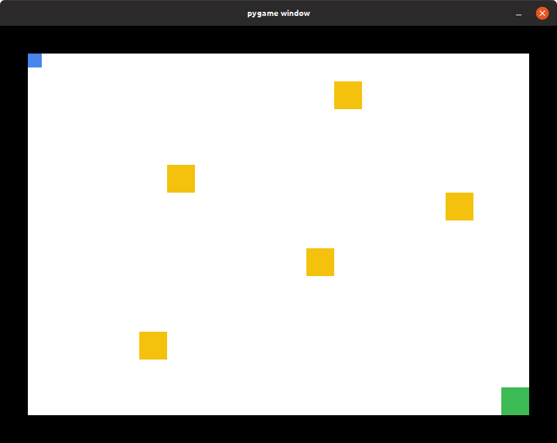
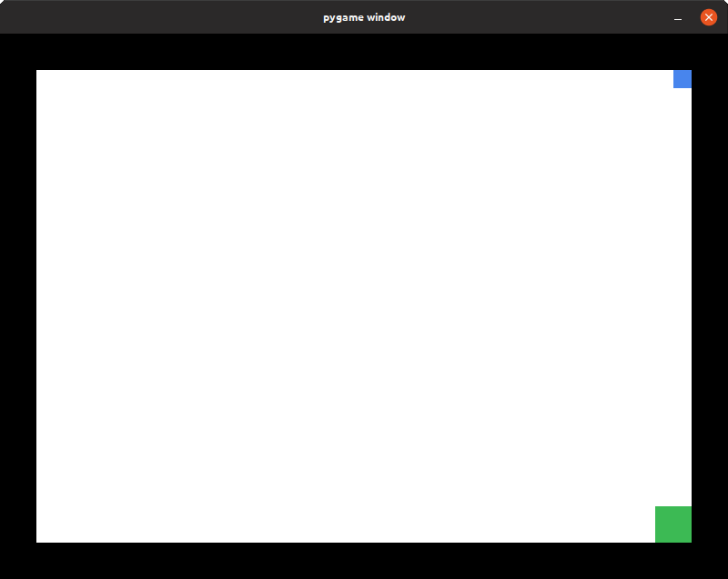
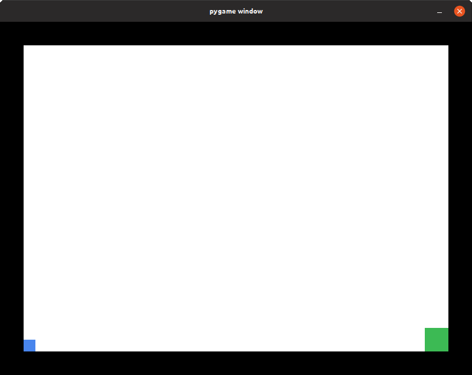
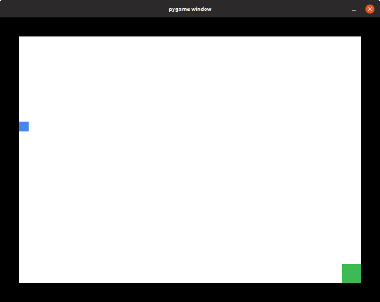
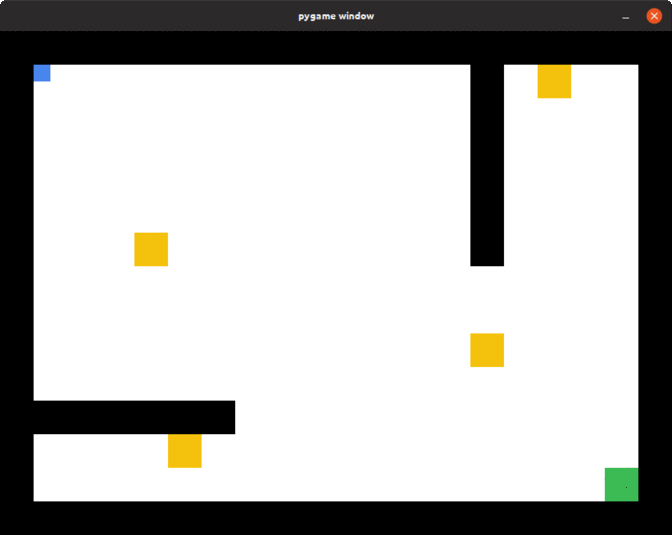

# AI Gaming Bot
Reinforcement learning using Q learn algorithm.

This is a Gaming bot which can learn and play a maze game. It learns based on the +ve and -ve rewards received for doing some action. Currently, it's capable of reaching some checkpoints, overcoming obstacles and reaching given destination.
  
Below are the level maps on which I have trained the bot.
## Level Maps:

  
  
  

 

### Level 1:
This level is to test if the bot can reach a particular destination in the shortest path possible or not. In time, it learns how to do it and always try to reach a particular location in the shortest path possible. 
As we can see, it's trying to find it's way to the destination by wandering around the area and checking where the reward is more.
  
Now, it has found the shortest path from it's location to the destination.
  
Once it understood how to reach a destination, we can try with different starting and ending points to test it's limitations.

  
  
  

I have only changed the starting location of the player and it works fine with any initial location. 
 Now let's go to level 2.
 

### Level 2:
In level 2, we'll make it learn how to reach certain checkpoints using the experience in the previous level.
  
Finally, the agent has learnt to pass through all the checkpoints and reach the goal.
 let's take the game to level 3 now.
 

### Level 3:
Here, there is a new challenge. The obstacles are in between the path to the checkpoints and the agent is unable to find a way around it. 
Its stuck in a position where it gets a negative reward for deviating from it's path and a neutral reward for trying the same path again and again. 
 
To overcome this kinda problem, we have to tell the agent that "It's OK to try some different path if no positive reward is awarded for a period of time." 
This can be done by tuning the alpha value (learning rate or randomness rate). Increasing this will help it find a solution by trying different paths than its regular path. 
 
Finally, It's able to reach the destination by overcoming the obstacles and covering all the check points. 

## Final Result:
 
